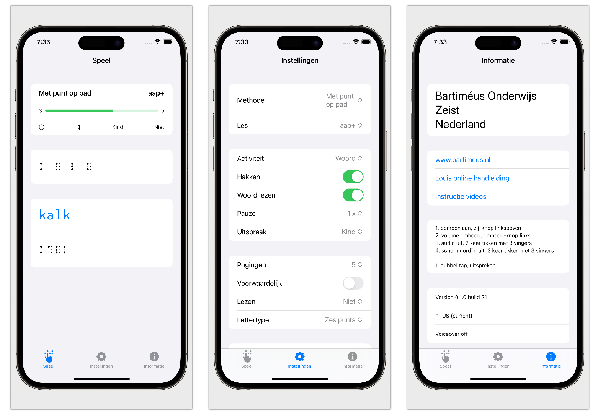

# DOTS
Platform to learn braille while using VoiceOver. 

## Refreshable brailledisplay
These are device which can be connected by bluetooth with a macOS or iOS device. By using the voiceOver utility all the items can be heared or accessed. 

## Methods
This software is developed in the Netherlands, therefore there are methods used here are implemented.

* Met punt op pad
* Braillepi
* Maréchal

## Localisation
Audiofiles and Methods are on a server. Therefore these can be easily changed and added.

## How to use
1. Turn mute off.
2. Adjust the volume level.
3. Turn on VoiceOver
4. Turn on brailledisplay and make sure there is a brailledisoplay connected with your iOS device. If not go to the accesiblity settings of your device.
5. Adjust the Settings.
6. Focus on text.

## Screenhots

## Settings
Methode
Lesson

Activity
Chop
Read word
Pause
Speech

Trys
Condition
Reading
Font

Made possible by Bartiméus Education, the Netherlands
[Bartiméus](www.bartimeus.nl)