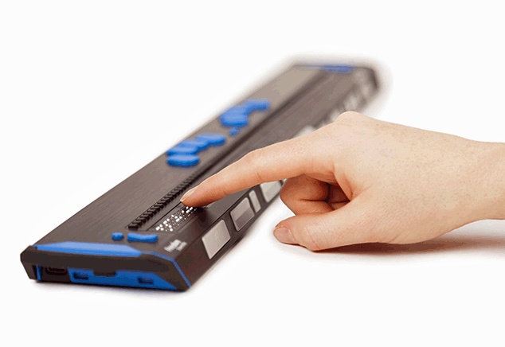
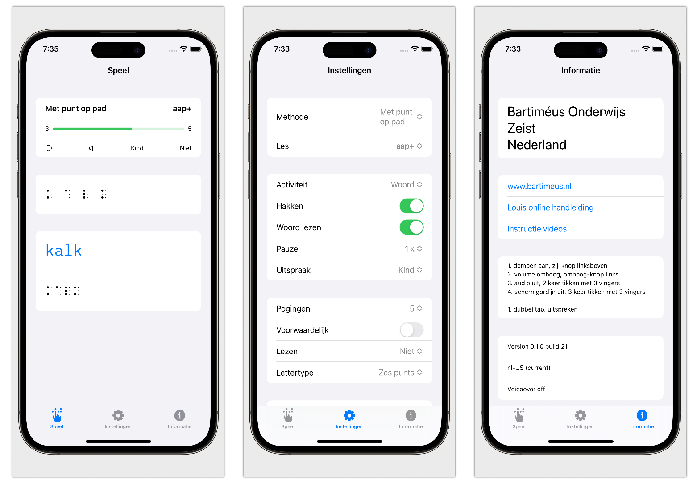

# Louis

Platform for learning Braille while using VoiceOver and a Braille display. Louis utilizes the accessibility features built into iOS. Louis can also be used by sighted individuals to visually learn Braille.

## Braille Display
This is a device connected via Bluetooth to an iOS device that displays Braille. Through VoiceOver functionality, all items can be heard and accessed.

## Methods
This software was developed in the Netherlands.

* Met punt op pad (for children)
* Maréchal (for adults)

<!--
## Localization
Methods are stored on a server. Therefore, they can easily be modified or added when needed. The audio files must be downloaded once. During installation, English or Dutch files are downloaded.
-->

## How to Use
1. Connect the Braille display via Bluetooth. Turn on the Braille display and ensure it’s connected to your iOS device.
2. Turn off silent mode (left switch on iPhone).
3. Adjust the volume level.
4. Enable VoiceOver.
5. Mute the VoiceOver voice (double-tap with three fingers on the screen).
6. If that doesn't work, go to your device's accessibility settings. 
7. Focus on text.

## Screenshots

<!--
## Video
[Overview Video](https://vimeo.com/810543898)
-->

## Settings

### Method
1. Method
2. Lesson: letters in a specific order

### Activity
1. Activity: recognize a letter or word
2. Segment: break a word into parts
3. Read word: listen to the sound of the letter/word
4. Pause: time between each activity
5. Speech: how letters are pronounced

### General

1. Attempts: number of tries
2. Conditional: whether you type the letter/word on the Braille display or use a button to move to the next word.
3. Reading: audio before/after/not on Braille display

<!--
### Louis Website

-->

### Test on TestFlight

Send an email to edequartel@barttimeus.nl to be added to the TestFlight team, or go to https://testflight.apple.com/join/tN73kP2E

**When the app crashes, delete it and reinstall the app through TestFlight**.

<!--
### VoiceOver and iPhone

Want to know more about operating your iPhone with a Braille display? Visit:  
[VoiceOver Explanation](https://edequartel.github.io/ict4vip/voiceover.html)
-->

<!--
## Localization

If you’re interested in Louis and want to localize it to your language, you will need:

1. **audio files** with spoken words,
2. files for individual characters and symbols,
3. a **method** for learning Braille (the order in which Braille is taught)
-->