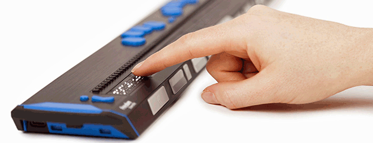

# Louis

Platform om Braille te leren terwijl je VoiceOver en een Braille-leesregel gebruikt. Louis maakt gebruik van de toegankelijke functies die bij iOS horen. Louis kan  ook worden gebruikt door mensen met zicht om visueel braille te leren.

## Braille-leesregel
Dit is een apparaat dat via Bluetooth is verbonden met een iOS-apparaat en braille weergeeft. Door de VoiceOver-functionaliteit kunnen alle items worden gehoord en benaderd.

## Methoden
Deze software is ontwikkeld in Nederland.

* Met punt op pad (kinderen)
* Maréchal (volwassenen)

<!--
## Lokalisatie
Methoden bevinden zich op een server. Daarom kunnen deze eenvoudig worden gewijzigd en toegevoegd wanneer dat nodig is. De audiobestanden moeten eenmalig worden gedownload. Bij het installeren van de app worden Engelse of Nederlandse bestanden gedownload.
-->

## Hoe te gebruiken
1. Verbind het vernieuwbare Braille-display.
2. Zet het geluid uit.
3. Pas het volumeniveau aan.
4. Schakel VoiceOver in.
5. Zet het Braille-display aan en zorg ervoor dat er een verbinding is met je iOS-apparaat. Zo niet, ga dan naar de toegankelijkheidsinstellingen van je apparaat.
6. Pas de instellingen aan.
7. Focus op tekst.

## Screenshots

## Video 
[Video met overzicht](https://vimeo.com/810543898)

## Instellingen

### Methode
1. Methode
2. Les: letters in een specifieke volgorde

### Activiteit
1. Activiteit: herken een letter of woord
2. Hak: verdeel een woord in stukjes
3. Lees woord: luister naar het geluid van letter/woord
4. Pauze: tijd tussen elke activiteit
5. Spraak: hoe de letters worden uitgesproken

### Algemeen

1. Pogingen: aantal pogingen
2. Voorwaardelijk: of je de letter/het woord op het Braille-display typt of met een knop naar het volgende woord gaat.
3. Lezen: audio voor/na/niet op Braille-display

## Test in TestFlight

Stuur een e-mail naar edequartel@barttimeus.nl en je wordt toegevoegd aan het TestFlight-team,  
of scan de QR-code

<!--
## Lokalisatie

Als je geïnteresseerd bent in Louis en het wilt lokaliseren naar jouw taal, heb je nodig:

1. **audiobestanden** met gesproken woorden,
2. bestanden voor individuele tekens en tekens,
3. een **methode** voor het leren van braille (de volgorde waarin je braille verstrekt)
4. -->
